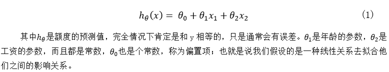
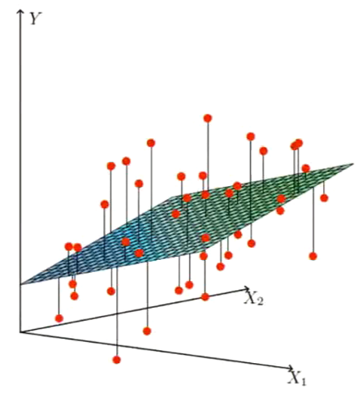
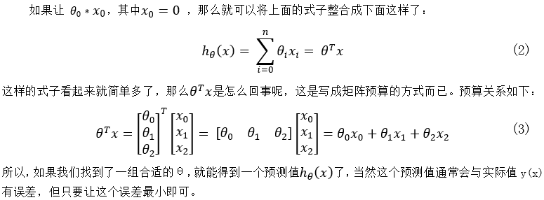
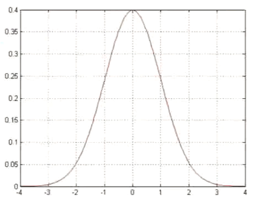
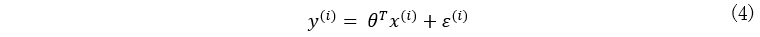
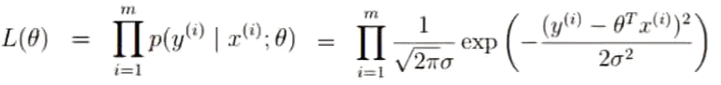
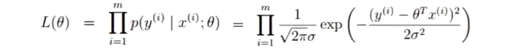
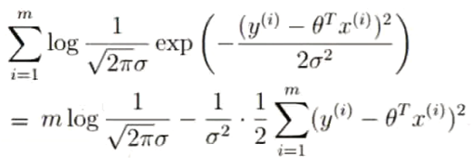
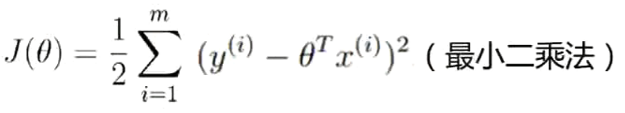
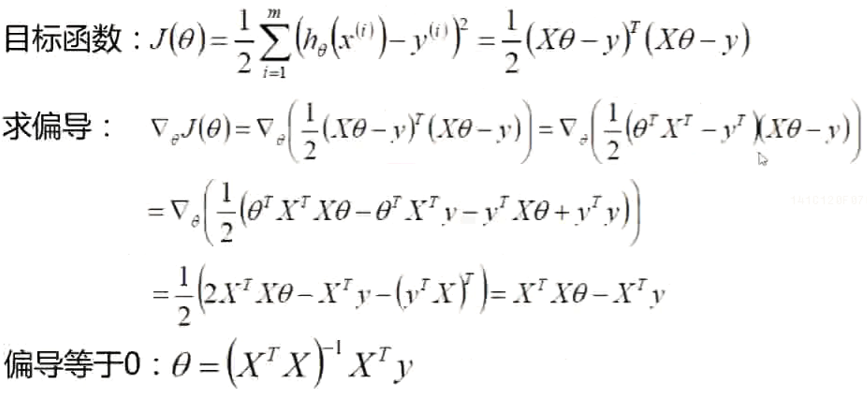

# 线性回归

一个例子开始：

| 样本序号 | 工资(x1) | 年龄(x2) | 贷款额度(y) |
| :------: | :------: | :--: | :-----: |
| 1 | 4000 | 25 | 20000 |
| 2 | 8000 | 30 | 70000 |
| 3 | 5000 | 28 | 35000 |
| 4 | 7500 | 33 | 50000 |
| 5 | 12000 | 40 | 85000 |

- 数据：工资和年龄，2个特征。

- 目标：预测银行贷款额度。

- 过程：根据给定样本两特征和对应的额度，需要寻找一种模型来反应这两特征和额度的运算关系，下次有人贷款就可根据其工资和年龄预测其可获得的贷款额度了。

   所以先假设有这样一种线性关系：

   

- 问题1：实际中的数据关系不可能是线性关系啊，为什么用线性关系去拟合？

   ​	原因很简单，线性关系简单啊；如果能用个更复杂的非线性模型去更准确地拟合函数关系，这当然是支持的，只是运算量大，且未必能找到。而如果用线性关系，我们总能找到一个平面让整体误差最小，如下图一样，所以最终的预测结果是会有误差的，不过有误差并不影响我们的预测。

   

也许你还会说很多时候并不是线性关系啊，比如下图要分类出所有的红点，用一条直线肯定是不够的，这是对的，那我们可以用很多条直线啊，总比用一些复杂模型好，这就是神经网络的思想，后面我们会说。

- 问题2：为什么需要偏置项θ_0?

   ​	假设没有偏置项，你会看到输出的平面必过零点，而实际很多都不过零点。一元线性函数中有y=ax+b，b就是偏置项，如果没有b则无法表示出不过零点的直线了。

**整合**

## 1. 概念

​	所以机器学习其实就是根据给定样本中的数据，通过不断的优化以寻找出一组合适的θ，使得整体误差最小，之后便可利用这个模型了，用这组θ与给定的x计算得到一个接近真实值的h(x)，而真实值y和这个预测值也将在误差范围内了，这就是机器学习的**线性回归（Linear Regression）**问题。

## 2. 误差

​	真实值和预测值之间的差异，我们称之为误差，用ε表示。
	所以对于每个样本来说，真实值和预测值之间有以下关系：

- 误差ε(i)是独立且具有相同的分布，且服从均值为0方差为θ^2（θ的平方）的高斯分布。
  - 样本之间相互独立。
  - 具有相同的分布。
  - 高斯分布：即正太分布，如银行贷款上下浮动一些，但大部分偏差都不会太多。

## 3. 似然函数

由前面内容可知预测值和误差存在的关系为：

同时误差服从高斯分布，其概率分布函数为：

其中exp就是常数e=2.71828，而u是假设等于0的平均值，即预测值围绕真实值上下浮动一些，但浮动的平均值为0。故得到了右边的式子。对于离散的ε(i)，表示其各个值的概率分布状态如上图所示；如果是连续的ε则就称之为概率密度函数了，那么要得到相应的概率则需要选取一段ε进行积分得到。这里我们的样本是离散的，所以只考虑离散的情况。

​	将上面的4式带入5式中，可得：

​	上面6式应该很好理解，其实就是误差的另一种表示形式而已，先不用去管式子左边为什么写成那样。你只需考虑，对给定的一个样本x(i)，要想预测值θ*x(i)越接近真实值y(i)，误差ε就得越小；根据概率分布图可知，误差ε值越小的地方，对应的概率值就越大。那么反过来，如果概率值p(ε)越大，对应的ε也就越小，这时预测值就越接近于真实值了。那么对于n个样本而言，如果每个样本的误差概率值越大，对应的每个误差ε也就越小，这样每个样本的预测值θx就越接近真实值y了，也就可确定对应的这组参数θ越合适。

​	我们不可能单独对每个p(ε)单独调优后又用于整体，所以就想如何整体的衡量所有的概率值都越大呢？因为每个样本是独立的，所以可以这样考虑，如A和B同时出现的概率是p(A)P(B)，那么要让每个样本整体的概率值越大，p(A)xP(B)的乘积也就越大，通常情况下，如果p(A)P(B)的乘积越大，说明此刻p(A)和P(B)也都是较大或最大的时刻；同样的道理，n个样本的情况下，如果p(ε(0)) p(ε(1))...p(ε(n))相乘后值就越大，此刻p(ε(0))到p(ε(n))每一个的概率值也都是较大或最大，那么这组θ就是比较合适的了。这样就需要引入似然函数通过求最大乘积概率来求解最合适的θ了。

>思考问题:
>
>是不是概率p(A)P(B)的乘积最大，对应的p(A)和P(B)的概率也分别最大？
>
>答: 当然不是的。每个概率最大时可以推出乘积最大，但乘积最大时并不能保证每个概率值最大，但可以推测出此刻对应的每个概率都处于较大值，即便存在一些特殊点，但不影响模型预测。同时我们也可能找不到一组合适的θ使得每个概率都最大，所以预测值会有误差。

这就引出了似然函数了

