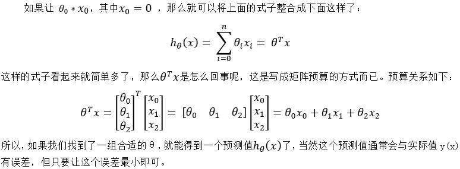

# 线性回归

一个例子开始：

| 样本序号 | 工资(x1) | 年龄(x2) | 贷款额度(y) |
| :------: | :------: | :--: | :-----: |
| 1 | 4000 | 25 | 20000 |
| 2 | 8000 | 30 | 70000 |
| 3 | 5000 | 28 | 35000 |
| 4 | 7500 | 33 | 50000 |
| 5 | 12000 | 40 | 85000 |

- 数据：工资和年龄，2个特征。
- 目标：预测银行贷款额度。
- 过程：根据给定样本两特征和对应的额度，需要寻找一种模型来反应这两特征和额度的运算关系，下次有人贷款就可根据其工资和年龄预测其可获得的贷款额度了。

		所以先假设有这样一种线性关系：

- 问题1：实际中的数据关系不可能是线性关系啊，为什么用线性关系去拟合？

   ​	原因很简单，线性关系简单啊；如果能用个更复杂的非线性模型去更准确地拟合函数关系，这当然是支持的，只是运算量大，且未必能找到。而如果用线性关系，我们总能找到一个平面让整体误差最小，如下图一样，所以最终的预测结果是会有误差的，不过有误差并不影响我们的预测。

   

也许你还会说很多时候并不是线性关系啊，比如下图要分类出所有的红点，用一条直线肯定是不够的，这是对的，那我们可以用很多条直线啊，总比用一些复杂模型好，这就是神经网络的思想，后面我们会说。

- 问题2：为什么需要偏置项θ_0?

   ​	假设没有偏置项，你会看到输出的平面必过零点，而实际很多都不过零点。一元线性函数中有y=ax+b，b就是偏置项，如果没有b则无法表示出不过零点的直线了。

**整合**

## 1. 概念

​	所以机器学习其实就是根据给定样本中的数据，通过不断的优化以寻找出一组合适的θ，使得整体误差最小，之后便可利用这个模型了，用这组θ与给定的x计算得到一个接近真实值的h(x)，而真实值y和这个预测值也将在误差范围内了，这就是机器学习的**线性回归（Linear Regression）**问题。

